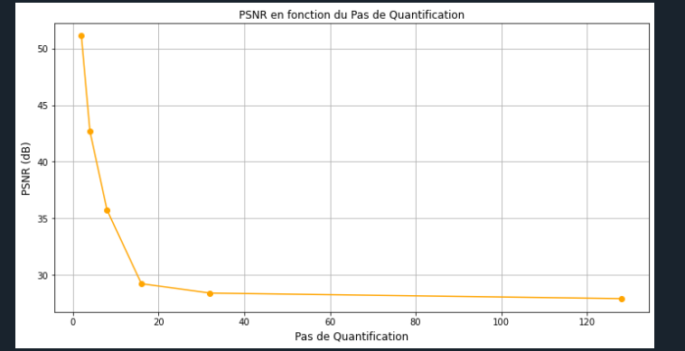
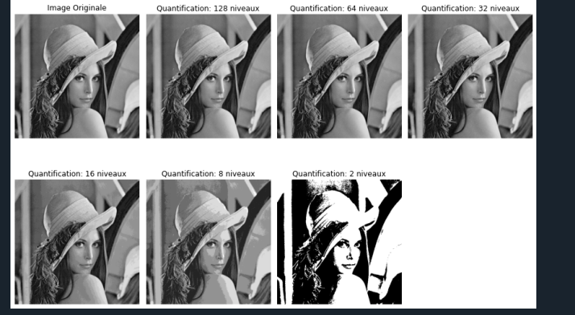

# Traitement d'image — quantification et échantillonnage

## Vue d'ensemble
TP de traitement d'image (formation 2023–2026) portant sur la quantification des niveaux de gris, la mesure de qualité (EQM, PSNR), le bruit et la réduction de résolution, sur l'image de test Lenna.

## Objectifs
- Quantifier une image avec différents pas et observer l'effet visuel.
- Tracer l'erreur quadratique moyenne et le PSNR en fonction du pas de quantification.
- Étudier l'ajout de bruit et le sous-échantillonnage (réduction d'un facteur 2).

## Architecture
Résultats et captures du code dans `assets/` :
- `lenna_niveaux_de_quantification.png`, `lenna_bruitee.png`, `lenna_reduite_2_fois.png`
- `eqm_fonction_pas_quantification.png`, `psnr_fonction_pas_quantification.png`
- `code_quantification.png`, `code_eqm_psnr.png`, `code_echantillonnage.png`, `code_reduction_image.png`

## Matériel
Aucun.

## Logiciel
À documenter (langage du TP visible sur les captures de code).

## Implémentation
Le code source est conservé dans une archive RAR non extraite ; seules les captures du code sont présentes pour l'instant.

## Principes d'ingénierie
- Compromis nombre de niveaux / qualité (EQM, PSNR).
- Repliement spectral lors du sous-échantillonnage.

## Résultats
Voir les courbes EQM/PSNR et les images dans `assets/`.

## Difficultés / limites
Scripts sources à ajouter (archive RAR à extraire manuellement dans `src/`).

## Structure
```
Traitement_Image_Quantification/
├── README.md
├── .gitignore
└── assets/
```

## Exécution
À documenter.

## Médias



## Compétences
Traitement d'image, quantification, métriques EQM/PSNR, échantillonnage.
