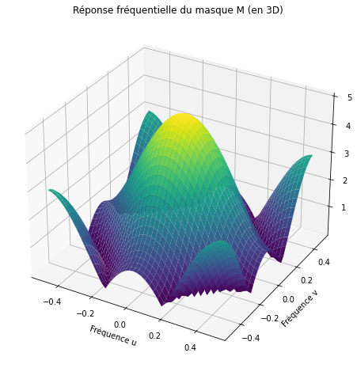

# TP1 — Image Analysis and Kernel Responses

This laboratory connects image-array representation to contrast measurements, intensity transformations and local derivative operators.

## Report and figures

The [original TP1 report](docs/report_tp1.pdf) covers image loading, array shape and memory size, RGB/LAB/HSV representations, synthetic patterns, sinusoidal images and Fourier analysis, then contrast and edge operators.



The report's colour-space and synthetic-pattern exercises are documented in the report and archived captures. The recovered executable scripts cover the following experiments.

## Executable experiments

Run each command from the repository root as `python -m labs.tp1_image_analysis.src.<module>`.

| Module | Experiment |
| --- | --- |
| `contrast_basic` | Mean brightness, Michelson contrast, intensity standard deviation and histograms of `poupee.tif` and `crane.png` |
| `contrast_equalisation` | Compare global histogram equalisation with CLAHE (`clipLimit=2`, `tileGridSize=(8,8)`) and calculate contrast before and after transformation |
| `edge_operators` | Compare local gradient operators on the grayscale Lenna input |
| `sobel_thresholds` | Inspect Sobel responses and thresholded edges on the flowers image |
| `laplacian_response` | Study a second-order derivative with signed floating-point output |
| `cross_mask_dtft` | Evaluate the analytical frequency response of a five-point cross mask on a normalised frequency grid |
| `cross_mask_fft` | Inspect the sampled 2-D FFT magnitude of the cross mask |
| `composed_kernels` | Convolve the cross mask with two directional derivative masks and compare the resulting frequency responses |
| `diagonal_mask_response` | Zero-pad the supplied diagonal derivative mask and plot its 2-D frequency-response surface |

```bash
python -m labs.tp1_image_analysis.src.contrast_equalisation
python -m labs.tp1_image_analysis.src.edge_operators
python -m labs.tp1_image_analysis.src.cross_mask_dtft
```

## Interpretation

- Mean brightness is the average pixel intensity. RMS contrast here is the intensity standard deviation, expressed in the image's intensity units.
- Michelson contrast is `(max - min) / (max + min)`. Extrema are converted to floating point before arithmetic to prevent `uint8` overflow; the all-black image is assigned zero contrast.
- The original scripts use two different quantities under the label “global contrast”: standard deviation in `contrast_basic`, and standard deviation divided by mean intensity in `contrast_equalisation`. Compare like definitions and intensity scales.
- Global equalisation remaps intensities using the image-wide histogram. CLAHE applies local equalisation with clipped histogram amplification; it can reveal local detail while also making texture or noise more visible.
- Gradient operators respond to directional intensity changes. The Laplacian is a second derivative and must retain negative as well as positive responses before visualisation.
- Spatial kernel composition corresponds to multiplication of their frequency responses. FFT plots sample that response; zero padding refines the displayed frequency grid without adding information to the kernel.

For `skimage.io.imread`, `as_gray=True` requests grayscale conversion. Colour images loaded through scikit-image use RGB channel order; OpenCV colour loading conventionally uses BGR. The equalisation script explicitly converts its RGB input with `COLOR_RGB2GRAY`.

## Evidence and provenance

`assets/` contains the recovered TP1 screenshots. These illustrate the original exercise session; plots produced by the runnable scripts are saved separately in `outputs/`. See the [archive map](../../docs/ARCHIVE_MAP.md) for the original `sanstitre*.py` filenames and changes made for execution.

## Additional captures recovered from `cle`

- `assets/representation/`: Lenna dimensions and loading, HSV channel extraction, sinusoidal patterns for several `d` values, and a corresponding FFT capture. [HSV channels](assets/representation/hsv_channels.png) and the [sinusoid/FFT pair](assets/representation/sinusoid_fft_period_32.png) extend the evidence for the report's image-representation exercises.
- `assets/contrast/`: input histograms, global equalisation, CLAHE images and the corresponding code and console captures. [CLAHE image comparison](assets/contrast/clahe_images.png) accompanies the existing executable equalisation experiment.

These contrast captures originally lived under `tp2/partie C` in Drive and are grouped here with the repository's contrast/equalisation scripts. Some historical console values show Michelson contrast above one, consistent with the original unsigned arithmetic. The current helper converts extrema to floating point before evaluation; use the current script outputs for numerical comparisons. Original captures are retained as session evidence, with their bytes unchanged.
