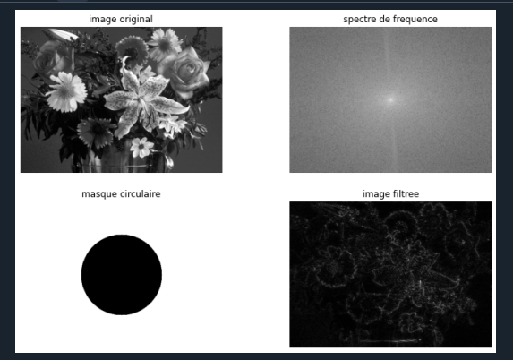

# TP2 — Spatial and Frequency Filtering

Study how local kernels and Fourier-domain masks modify image structure, and how numeric representation affects the comparison of implementations.

## Reports

- [Complete TP2 report](docs/report_tp2.docx): frequency-domain experiments and spatial filtering.
- [Spatial-filtering exercise draft](docs/spatial_filtering_draft.docx): the complementary exercise document retained with the complete report.



## Run the experiments

```bash
python -m labs.tp2_filtering.src.spatial_operator_comparison
python -m labs.tp2_filtering.src.smoothing_filters
python -m labs.tp2_filtering.src.frequency_filtering
```

The first two scripts were recovered from the Drive archives. `frequency_filtering.py` is a runnable reconstruction of the report and Fourier code screenshots. All use the shared `flowers.tif` input and export figures under `outputs/tp2_filtering/`.

## Spatial operators

`spatial_operator_comparison.py` evaluates the two supplied 3×3 kernels:

```text
K1 = [[ 0, -1,  0],     K2 = [[ 0, -1,  0],
      [ 1,  1,  1],           [-1,  1,  1],
      [ 0, -1,  0]]           [ 0,  1,  0]]
```

OpenCV `filter2D` computes correlation, whereas SciPy `convolve2d` computes convolution. To compare the same operation, the OpenCV path flips both kernel axes, uses `CV_64F` and `BORDER_REFLECT`, and the SciPy path uses `mode='same', boundary='symm'` on the same floating-point image. This retains signed responses and aligns boundary handling. The numerical test checks agreement to an absolute tolerance of `1e-12` on a synthetic input.

`smoothing_filters.py` compares a 5×5 box average, a 5×5 Gaussian blur with automatically selected sigma, a 5×5 median filter, and bilateral filtering (`d=9`, `sigmaColor=75`, `sigmaSpace=75`). This experiment deliberately converts the normalised grayscale image to 8-bit intensity before applying the OpenCV operators. Averaging and Gaussian filters smooth spatial variation; median filtering uses local order statistics; bilateral weights combine spatial distance and intensity similarity.

## Frequency-domain pipeline

1. Convert the grayscale input to floating point and calculate its complex 2-D FFT.
2. Centre the spectrum with `fftshift` and display `log1p(abs(spectrum))`.
3. Build a circular mask around the DC bin using radii 10, 100 and 200 **frequency-bin pixels**.
4. Retain the disk for low-pass filtering or its complement for high-pass filtering.
5. Multiply the complex spectrum by the mask, undo the shift and calculate the inverse FFT.

NumPy's inverse FFT supplies the inverse-transform normalisation. The real reconstructed response is retained; high-pass responses are signed and are not converted to absolute values or clipped to `uint8`. Ideal circular masks can introduce ringing because their frequency boundary is discontinuous. The chosen radius is a discrete-grid distance, not a physical frequency in hertz.

The reconstruction produces six figures, each showing the input, centred spectrum, mask and filtered response. Tests check that a radius-zero low-pass mask retains a constant image, that its complement removes DC, and that complementary filtered outputs sum back to the input for both odd and even shapes.

## Archived evidence

`assets/spatial/` and `assets/frequency/` preserve the original screenshots, including the 5×5, 7×7 and 9×9 spatial-filter trials and the original OpenCV Fourier snippets. Their results belong to the original implementation; they are kept separate from figures generated by the corrected runnable scripts.

API references: [OpenCV image filtering](https://docs.opencv.org/4.x/d4/d86/group__imgproc__filter.html), [SciPy convolve2d](https://docs.scipy.org/doc/scipy/reference/generated/scipy.signal.convolve2d.html).

## Recovered smoothing comparison

The additional [five-panel smoothing figure](assets/spatial/smoothing_filters_result.png) and [operator code capture](assets/spatial/smoothing_filters_code.png) were recovered from `cle/traitement d'image/tp2/exercice 2`. They complete the original evidence for the already integrated box, Gaussian, median and bilateral filtering script.
