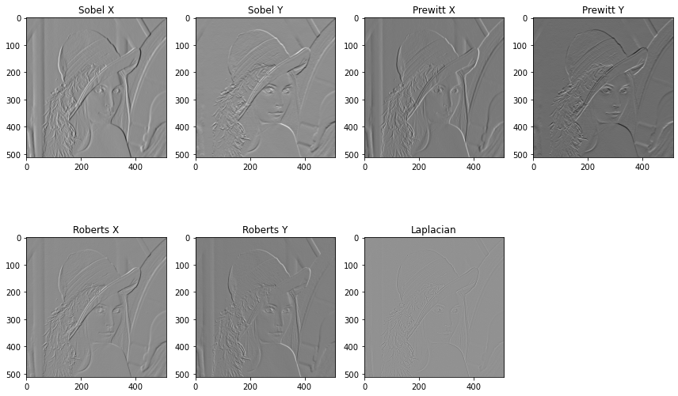

# TP3 — Edge Detection and Derivative Operators

Four original figures recovered from `cle/traitement d'image/tp3` document directional edge responses, magnitude thresholding and a frequency-response comparison.



## Experimental evidence

| Figure | What it shows |
| --- | --- |
| [Lenna derivative responses](assets/lenna_edge_operators.png) | Separate X/Y outputs for Sobel, Prewitt and Roberts, alongside a Laplacian response |
| [Flowers derivative responses](assets/flowers_edge_operators.png) | The same operator families applied to a second image with different texture and edge structure |
| [Sobel magnitude and thresholds](assets/sobel_threshold_comparison.png) | Directional responses, combined magnitude and binary results labelled with thresholds 50 and 100 |
| [Frequency-response comparison](assets/frequency_response_comparison.png) | Archived curves labelled Sobel, Prewitt, Roberts and Laplacian, with an angular-frequency axis in radians/sample |

## Reproduce related experiments

The repository already contains the recovered derivative-operator scripts in the TP1 source collection. Reuse them from the repository root:

```bash
python -m labs.tp1_image_analysis.src.edge_operators
python -m labs.tp1_image_analysis.src.sobel_thresholds
python -m labs.tp1_image_analysis.src.laplacian_response
```

These scripts generate fresh figures in `outputs/tp1_image_analysis/`. The four files above remain the unchanged original TP3 captures; the comparison curve is an archived result rather than an output generated by these commands.

## Technical reading

First-order derivative operators emphasise directional intensity changes. Sobel combines differentiation with smoothing across the orthogonal direction; Prewitt uses uniform orthogonal weights; Roberts operates on diagonal differences over a 2×2 neighbourhood. The gradient magnitude combines the two directional responses before a threshold produces a binary map.

The Laplacian is a second derivative. Signed floating-point output preserves positive and negative responses; converting derivative results directly to unsigned image intensities can alter their appearance. Operator scale, kernel size and intensity range affect the meaning of a fixed threshold. The current scripts retain floating-point derivative responses, so their plots can differ from the archived session.

See the [TP1 guide](../tp1_image_analysis/README.md) for shared image and kernel-response conventions, and the [Drive comparison](../../docs/CLE_IMAGE_REVIEW.md) for the provenance of these four figures.
